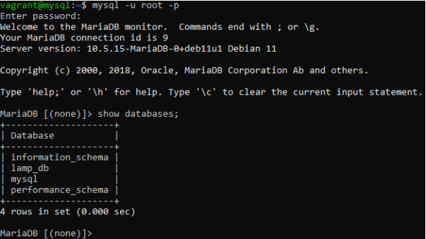

# lmap_2nvl
## Creamos las configuraciones para las dos maquinas virtuales.
#### Le asignamos sus IPs y los scripts con los que se aprovisionaran.

### Este es el script que he usado para la maquina php.

### Este es el script que he usado para la maquina mysql.

### Comprobamos que ambas maquinas se han iniciado corractamente.

### Creamos la carpeta "phpserver" y le cambiamos el propietario, dentro de la carpeta descargamos el git hub de "iaw-practicas-lamp", movemos todos los archivos de la carpeta "src" a la que hemos creado.

### Hacemos una copia de el archivo "000-default.conf" y la editamos (paso en la siguiente captura), tambien deshabilitamos el archivo "000-default.conf" y habilitamos el nuestro procediendo a hacer un reload al final. 

### Cambiamos la ruta a la nueva que es la carpeta que hemos creado anteriormente.

### Editamos el "config.php" y le cambiamos el host a la IP de la maquina de mysql.

### Por ultimos instalamos el mysql server en la maquina de php y le hacemos un reload, ademas de buscar la IP en el navegador y comprobar que nos aparace.

### En la maquina de mysql editamos el archivo "50-server.conf" y en blind-addess cambiamos la IP a la de la maquina mysql.
### Tambien entramos en mysql y creamos el user lamp con el host siendo la IP de la maquina apache y la respectiva contraseña, por otro lado tambien le damos todos los privilegios a la base de datos "lamp_db" y hacemos un flush privileges.

### Descargamos tambien en la maquina mysql el git hub de "iaw-practica-lamp" y entramos en la carpeta "db", editamos el archivo "database.sql" y le borramos las tres ultimas lineas y por ultimo ejecutamos el comando "mysql -u root -p < database.sql" para añadir la base de datos.

### Entramos en el mysql y vemos que la base de datos esta 

### Añadimos unos datos a la base de datos desde la pagina.

### Ahora entramos a mysql desde la maquina php y entramos con el user lamp, la IP de la maquina mysql, para comprobar que los datos que añadimos desde la web aparecen en la base de datos.
